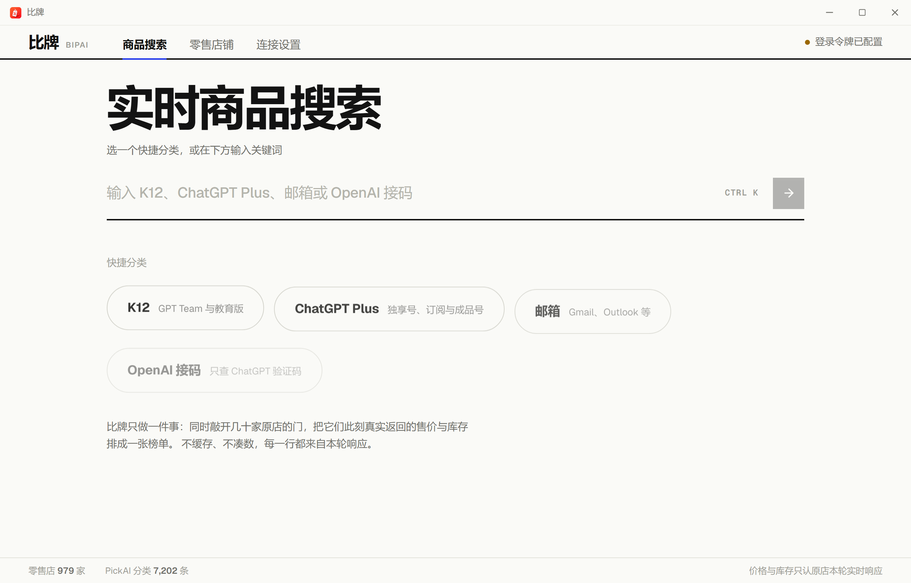
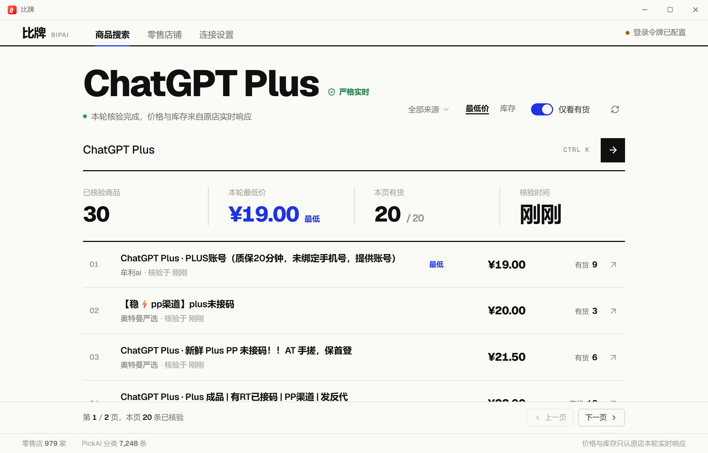
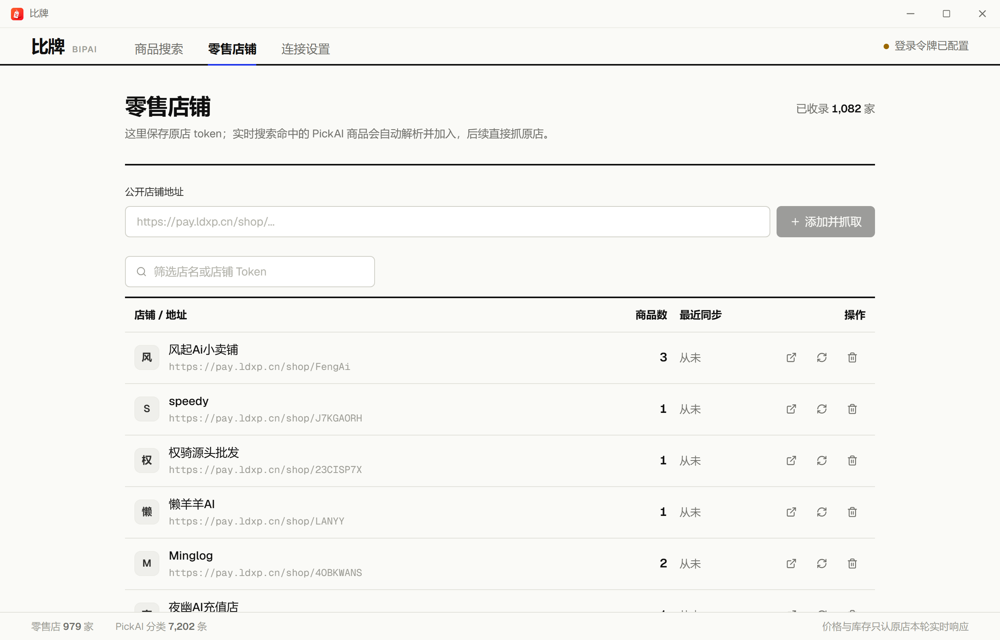
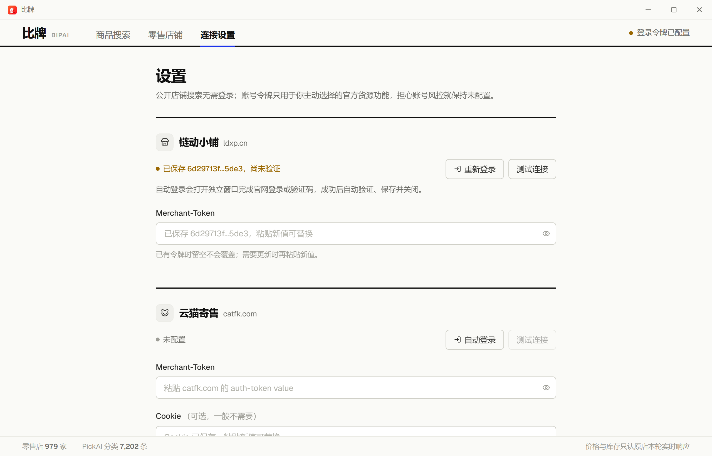

# 比牌 · 链动小铺商品搜索

一个本地运行的商品搜索工具。PickAI 只负责发现商品入口，最终价格和库存以链动原店
接口为准；K12、ChatGPT Plus、邮箱、OpenAI 接码快捷搜索会用 SQLite/PickAI 选出少量候选店，
再直接读取本轮原店价格和库存，未经本轮核验的缓存不会进入结果。桌面版首次启动会导入内置 PickAI 快照，
但不会启动全量百余分页同步。

界面采用信息密度优先的桌面工具布局：左侧快捷分类、顶部全局搜索、右侧实时结果表。组件由 React + Tailwind + lucide 直接实现，不依赖现成 UI 框架。



| 原店实时核验 | 零售店铺 | 连接设置 |
| --- | --- | --- |
|  |  |  |

## 技术栈

| 层 | 选型 | 说明 |
|---|---|---|
| 公开请求 | `curl_cffi`（impersonate=chrome） | 保持浏览器 TLS/JA3 兼容；全局 TUN 下自动绑定物理网卡直连国内源站 |
| 公开页解析 | `selectolax` | 比 BeautifulSoup 快很多 |
| 后端 | FastAPI + SQLModel + SQLite | 本地零配置，缓存当前商品结果 |
| 前端 | React + Vite + TS + Tailwind v4 | TanStack Query |
| 桌面壳 | Tauri 2 + PyInstaller | 无边框原生窗口，Python 后端作为内置 sidecar 随应用启停 |

## 目录结构

```text
PriceAIPlus/
├─ crawler/            # Python 后端：抓取引擎 + FastAPI
│  ├─ app/
│  │  ├─ crawler/      # curl_cffi 会话、货源广场/公开店铺适配器
│  │  ├─ pickai_index.py # PickAI 全量分页同步、状态与本地入库
│  │  ├─ models.py     # Shop / Product
│  │  ├─ service.py    # 完整分页抓取 + 当前结果缓存
│  │  └─ api.py        # FastAPI 接口
│  ├─ backend_entry.py # PyInstaller 打包入口
│  └─ requirements*.txt
├─ frontend/           # React 前端
│  ├─ src/{components,views,lib}
│  └─ src-tauri/       # 桌面壳、窗口控制与 sidecar 生命周期
└─ screenshots/
```

## 本地运行

后端（终端 A）：

```powershell
cd crawler
python -m venv .venv
.\.venv\Scripts\pip install -r requirements.txt
.\.venv\Scripts\python -m app.main      # http://127.0.0.1:8756
```

前端（终端 B）：

```powershell
cd frontend
npm install
npm run dev                              # http://localhost:5173
```

开发模式的数据保存在 `crawler/data/`，只写入真实搜索和店铺抓取结果。

## PickAI 全量公开报价

桌面服务启动时只读本地或内置快照，不会自动遍历 PickAI 的百余个分页。搜索时只请求
当前关键词的相关页，不会把全量目录同步塞进每次搜索。需要最新全量公开报价时，点击界面的“重新同步”，或手动执行：

```powershell
cd crawler
.\.venv\Scripts\python sync_pickai.py --workers 3
```

同步同时生成两个可独立处理的文件（`crawler/data/` 已被 Git 忽略）：

```text
crawler/data/pickai_snapshot.json  # 分类、标准商品、全部报价、中转 API 数据
crawler/data/pickai_quotes.csv     # 扁平报价表，Excel 可直接打开
```

无需联网重新抓取即可把现有 JSON 快照重新导入 SQLite：

```powershell
.\.venv\Scripts\python sync_pickai.py --import-existing
```

## 构建 Windows 桌面版

先安装后端构建依赖：

```powershell
cd crawler
.\.venv\Scripts\pip install -r requirements-build.txt
```

构建单文件免安装便携版：

```powershell
cd ..\frontend
npm run desktop:portable
```

产物只有一个文件：

```text
frontend/src-tauri/target/release/portable/比牌.exe
```

主程序已内嵌 Python 后端。首次运行会自动释放到
`%LOCALAPPDATA%\Bipai\runtime`，用户只需双击 `比牌.exe`。

如需同时生成 NSIS 安装包：

```powershell
npm run desktop:build
```

最终安装包位于：

```text
frontend/src-tauri/target/release/bundle/nsis/比牌_0.2.71_x64-setup.exe
```

便携版和安装版都不需要用户另装 Python。数据库、日志和凭据保存在
`%LOCALAPPDATA%\Bipai`，卸载或升级应用时不会因安装目录权限而丢失。

## 代理 / TUN 兼容

无需关闭 Clash、fcclient、sing-box 等代理客户端。Windows 桌面版会为
`ldxp.cn`、`pickai.cc`、`catfk.com` 及阿里验证资源自动选择带真实网关的物理网卡，
使用本地路由器 DNS 解析真实地址，并把源站连接绑定到该网卡；其他应用仍按原来的
全局代理/TUN 配置运行。隔离 Edge 需要真人验证时，也只通过应用内部监听在
`127.0.0.1` 的受限 CONNECT 代理访问这些白名单域名，不会开放局域网代理。

如网络环境禁止物理直连，可在启动前设置 `PRICEAI_PHYSICAL_DIRECT=0` 回退到系统路由。

## 接真实数据

普通 PickAI + 公开原店搜索不要求登录，也不会发送 Merchant-Token。只有需要当前账号的
GoodsPool 官方货源时，才在「设置」中主动配置账号令牌；有封号顾虑就保持免登录模式。
如果以前保存过令牌，可在「设置」点击“清除链动凭据”，立即删除本机 Token/Cookie。

在「商品搜索」输入关键词即可先看候选，并等同一次实时请求在后台替换结果；需要单次查询最新状态时，可直接粘贴
   `https://pay.ldxp.cn/shop/...` 或 `https://pay.ldxp.cn/item/...`。

## 搜索范围

- 快捷分类：Plus/邮箱/接码每轮先读取 PickAI 当前最低价页；邮箱会严格读取
  Outlook/Hotmail、iCloud、Gmail/Google、教育邮箱和其他邮箱五个标准分类。本地索引只负责把商品 URL
  映射到店铺；随后筛选最多 8 家候选原店并以两个受全局节流的 worker 核验。不会再
  在首家返回一条有货后立即停止：默认至少收集 2 家、目标 6 条结果后才提前结束。
  原店 `goodsList` 本轮返回后才展示售价和库存，PickAI 的延迟库存只参与候选排序，
  绝不进入结果。
- PickAI：桌面版内置去重后的全量快照只用于首屏候选；关键词搜索只拉取当前页，不会遍历全站分页。
- 零售索引：不在启动或定时器中自动刷新；实时搜索只查当前关键词需要的店铺。
- 店铺链接：已知 `/shop/<token>` 时完整读取该店的 `card/article/resource/equity` 商品。
- 商品链接：粘贴链接，或在商品详情点“手动查最新”时，才会用 `goodsInfo + goodsList`
  单次查询该商品的上架状态、售价和库存。
- 实时库存口径：原店接口返回 JSON 并完成核验后才标记“原店实时”。如果
  `pay.ldxp.cn` 返回阿里云滑块/验证页，本次商品会标成“库存未知”并从“只看有货”中
  隐藏，不会拿 PickAI 延迟快照冒充实时有货。桌面版会提供“拖一次，自动重搜”：
  在隔离的免登录 Edge 窗口完成一次真人滑块后，程序保留该已验证浏览器，后续公开
  `shopApi` 直接在同一浏览器上下文执行并自动重搜；不会读取日常浏览器或商家登录态。
  未完成真人验证时只触发约 15 秒固定本地保护，不再沿用 180～1800 秒指数冷却。
- 原店核验始终使用公开匿名会话，不会把 Merchant-Token/Cookie 带进
  `pay.ldxp.cn/shopApi` 的批量商品请求；遇到滑块时继续保守标记为未知。
- 链动小铺没有提供全站零售搜索接口；从未出现在货源池、公开网页索引或任何公开链接中的
  隐藏店铺无法被外部程序凭关键词枚举。

## 为什么采用“PickAI 发现、原店核验”

PickAI 的报价和库存是聚合快照，不能当成下单前的最终状态。现在的链路是：

1. PickAI 只用来召回当前关键词的商品链接（不携带你的链动凭据）。
2. 用商品链接调用 `pay.ldxp.cn` 的 `goodsInfo` 找到所属公开店铺 token，并把店铺写入本地店铺库。
3. 对该店铺调用 `goodsList`，用原店返回的价格、上架状态和库存覆盖聚合结果；默认“只看有货”只接受本次原店核验成功的记录。
4. 成功后同时保存原店 `category_id`；后续搜索可直接用一次分类 `goodsList` 获取该店当前
   价格和库存，不再每次重复 `goodsInfo + goodsList`。已发现的店铺也可在「零售店铺」页单独刷新。

不做一次性把 PickAI 的 7,000 多条报价逐条转成 1,000 多家店的全量抓取：PickAI 本身不返回完整店铺目录，逐条解析会产生上千次原店请求并很容易触发滑块，既慢又会把站点打进冷却。增量拿 token、按关键词抓原店才是实时和速度的平衡；需要全量覆盖时再手动启动零售索引。

## 注意

多数场景是用你自己的商家账号采集，请求间隔与并发已有意保守（0.7–1.6s、并发 3），
避免触发风控。Merchant-Token 和 Cookie 只保存在本机数据目录，不要提交进 Git。
